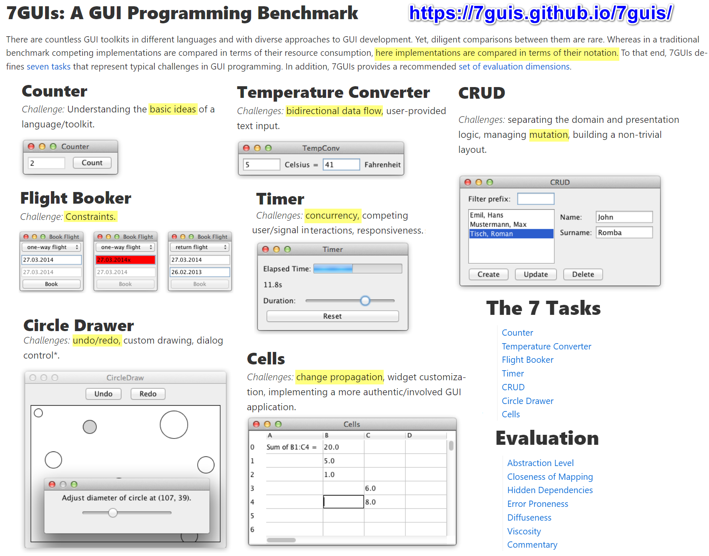

# imba-7ui

- original idea https://7guis.github.io/7guis/
- implement 7guis in imba. result in https://imba-7gui.surge.sh/
- official imba site have demo in https://imba.io/try/examples/7guis/counter/app.imba

## how do i
- [x] counter - just simple variable, no useState()
- [x] temperature converter - learn get and set keyword, better use @input
- [x] book flight - Date.toIsoString toDateString
❌ timer - my solution = autorender, solution = imba.commit
- [ ] crud
- [ ] circle drawer
- [ ] cells